# Opening up technical possibilities

## How can we know that a data source is reliably obtained?

## Consider the case of Gino

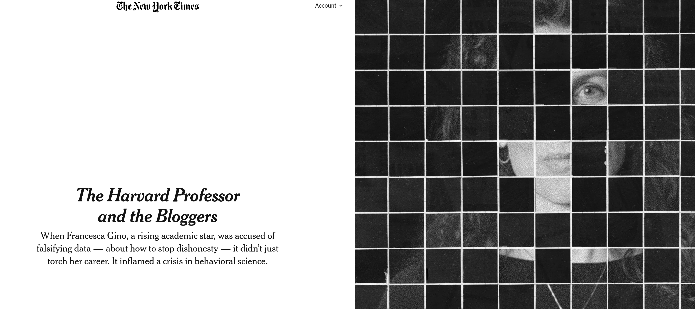

## The case of Gino

- Francesca Gino was a tenured professor at Harvard Business School, writing on honesty (!)

## The case of Gino

- Several articles were investigated by third parties (Data Colada, in particular [^colada1]), and found to be problematic

::::{.columns}  

::: {.column width="10%"}
:::

::: {.column width="80%"}
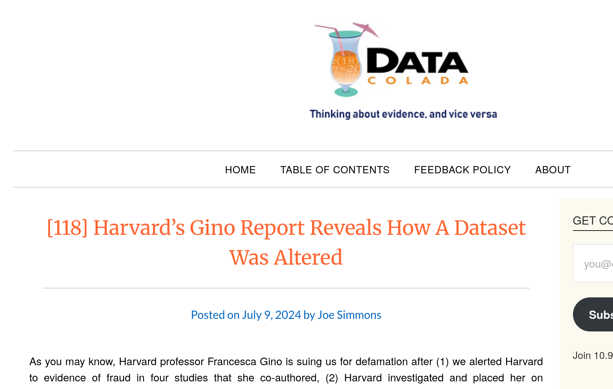

:::
::: {.column width="10%"}
:::
::::

[^colada1]: <https://datacolada.org/109>, <https://datacolada.org/110>, <https://datacolada.org/111>, <https://datacolada.org/112>, <https://datacolada.org/114>, <https://datacolada.org/118>

## The case of Gino

- At least one of them had manipulated data **AFTER** it had been collected, **BEFORE** it had been analyzed.

:::: {.columns}

::: {.column width="50%"}

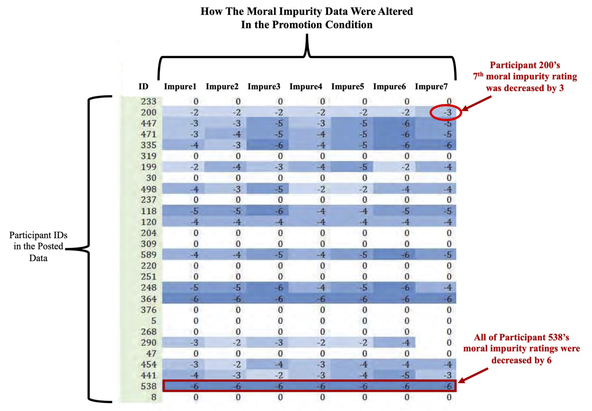

:::

::: {.column width="50%"}

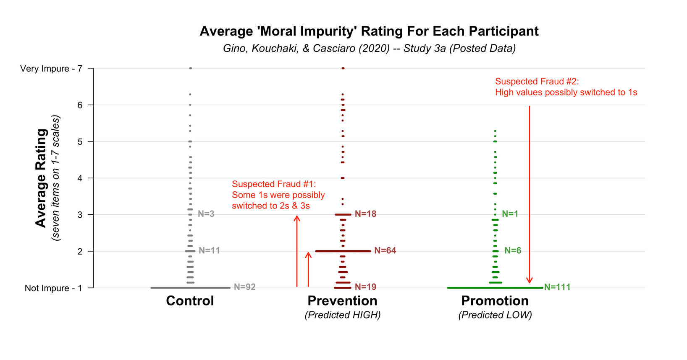

:::
::::

## Generic survey processing

::: {.white-col}
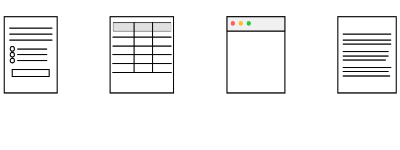
:::

## Generic survey processing

::: {.white-col}
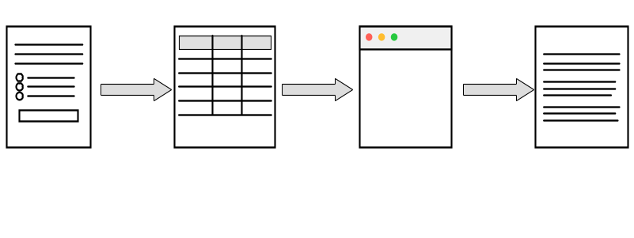
:::

## Requiring transparency in academia

::: {.white-col}
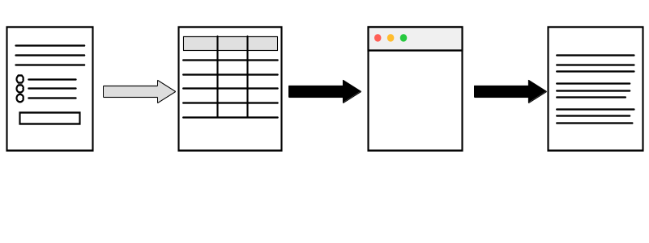
:::

## Verifying transparency in academia

::: {.white-col}
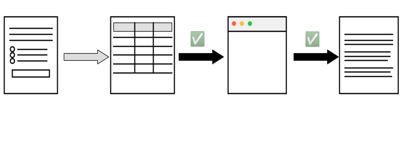
:::

## Verification by journals

- **Provision** (publication of materials) provides transparency
- **Verification** (running the analysis again - computational reproducibility) compensates for *mistrust*/*absence of trust*

## Which journals again {.smaller}

- [American Economic Association](https://www.aeaweb.org/journals/) (8)
- [Econometric Society](https://www.econometricsociety.org/) (3)
- [Canadian Journal of Economics](https://www.economics.ca/cje-home) (1)
- [Royal Economic Society](https://res.org.uk/journals/) (2)
- [Western Economic Association International](https://weai.org/view/EI-Journal-Policies) (1)
- [European Economic Association](http://www.eeassoc.org/journal) (1)
- [Review of Economic Studies](https://www.restud.com/) (1)
- [Journal of the European Economic Association](https://academic.oup.com/jeea) (1)
- [Journal of Political Economy](https://www.journals.uchicago.edu/journals/jpe/about) (3)
- [American Journal of Political Science](https://onlinelibrary.wiley.com/page/journal/15405907/) (1)
- [American Political Science Review](https://www.cambridge.org/core/journals/american-political-science-review) (1)

## Verification by others

::::{.columns}
:::{.column width="50%"}

- Pre-publication: [cascad](https://www.cascad.tech/)

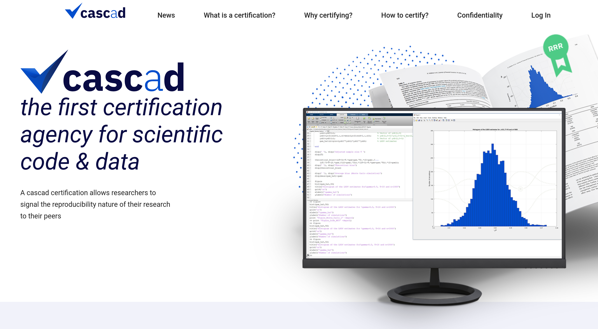

:::
:::{.column width="50%"}

- Post-publication: [Data Colada](https://datacolada.org/), [Institute for Replication](https://i4replication.org/)

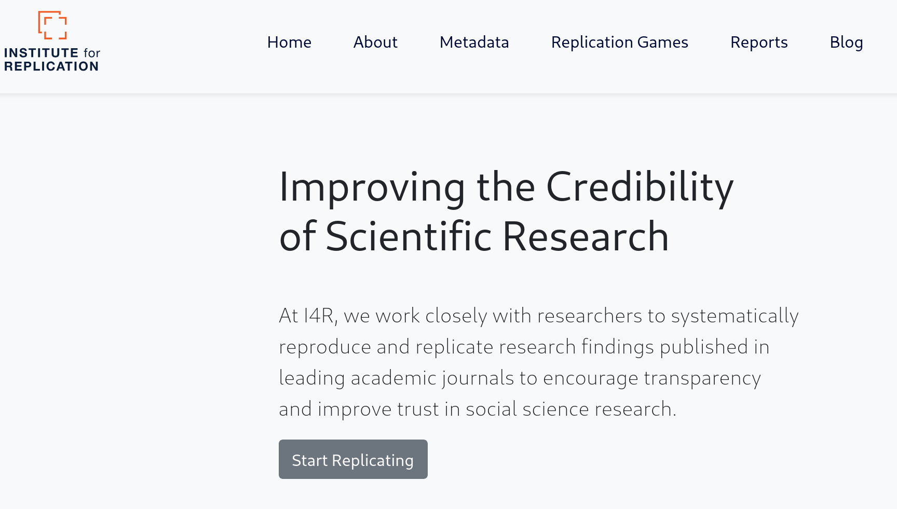

:::
::::

## Verification by institutions

::::{.columns}
:::{.column width="50%"}

- [World Bank](https://www.worldbank.org/en/research/brief/data-reproducibility-policy)[^jones]

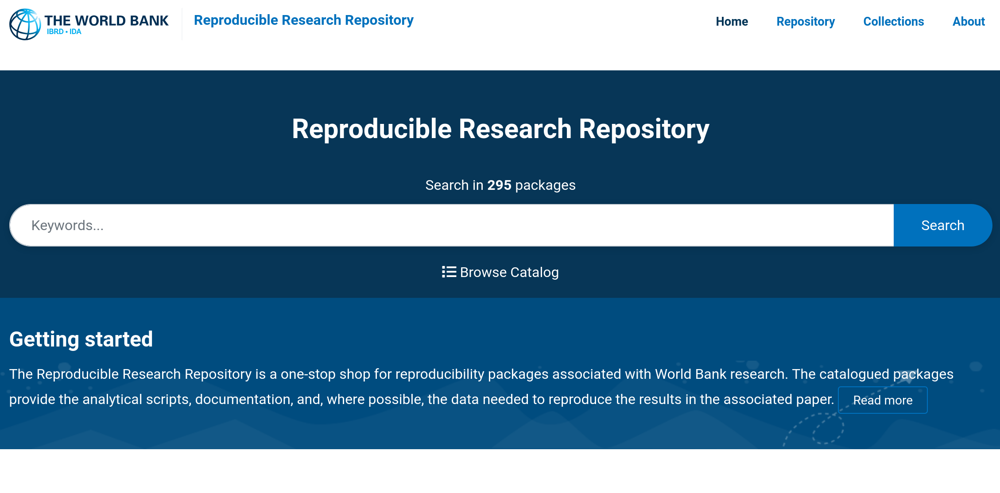

[^jones]: Jones, M. (2024). Introducing Reproducible Research Standards at the World Bank. Harvard Data Science Review, 6(4). <https://doi.org/10.1162/99608f92.21328ce3>

:::
:::{.column width="50%"}

:::
::::

## Taking it a step further

::: {.white-col}
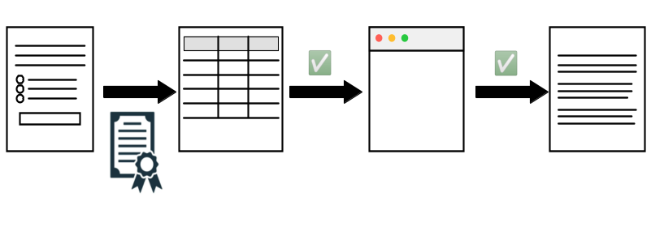
:::

## Taking it a step further

- Has been discussed by authors behind Data Colada
- Survey tool provider (Qualtrics, etc.) exports data, posts checksum
- Survey tool provider exports data only to institution directly into trusted repository, researchers obtain data from there (with privacy protections)

## Does not prevent all fraud

::::{.columns}
:::{.column width="50%"}

[Toronto researcher loses Ph.D.](https://retractionwatch.com/2024/04/26/psychology-researcher-loses-phd-after-allegedly-using-husband-in-study-and-making-up-data/)

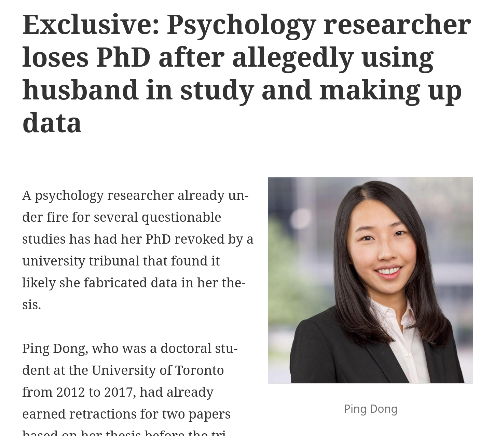

:::
:::{.column width="50%"}

[MIT student makes up firm data](https://economics.mit.edu/news/assuring-accurate-research-record)

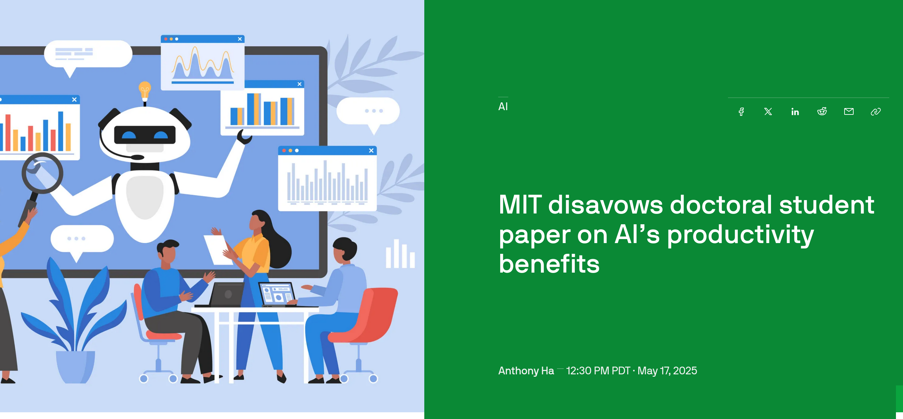

:::
::::

## Can Assurances be created for Statistical Agencies?

::: {.white-col}

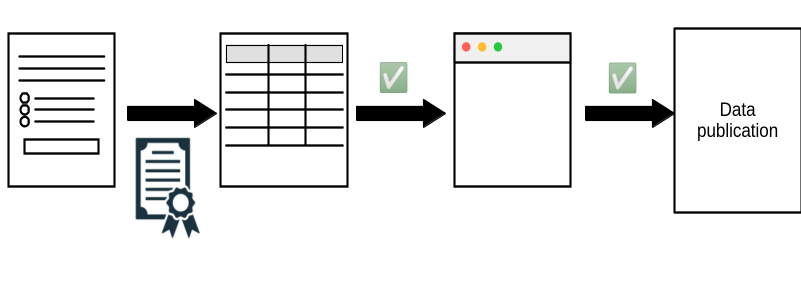
:::

## Challenges for statistical agencies

- Documenting full transparency is hard
- Complex and legacy survey tools make the process harder
- Presence of (legitimate!) manual edits is an issue
- Production processes are long and complex
- Much of the code base is not open source

## How to document the full process?

::: {.white-col}
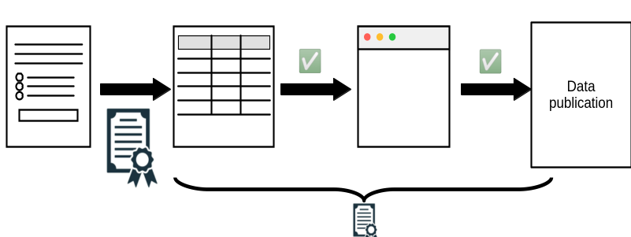
:::

## A sketch: Transparency Certified

<https://transparency-certified.github.io/>

## Work in progress

- Working with [cascad](https://www.cascad.tech/), several [INEXDA](https://inexda.org) members, and others
- Relying on external certification of data inputs (data catalogs with metadata, checksums)
